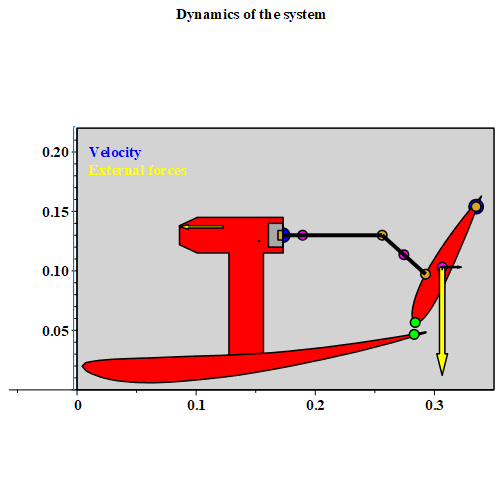

# Modeling and simulation of mechatronic systems [140469]
Project developed for the Modeling and Simulation of Mechatronics System course of the master's degree in Autonomous System (EIT), University of Trento.

## Information
Course professor: Francesco Biral.

Collaborators: 
- [Matteo Mastrogiuseppe](https://www.linkedin.com/in/matteomastrogiuseppe/)
- [Giacomo Mutti](https://www.linkedin.com/in/giacomo-mutti/)

The course focused on studying open-chain and closed-chain mechatronics systems.
Concerning the theory, for the kinematics, we saw the recursive, the global, and the natural coordinates approaches.
For the dynamic, we saw the Newton-Euler approach, the Lagrange approach, and the D'Alambert principle (principle of virtual work).

## Description
The aim of the project is to model the Drag Reduction System (DRS) used by Formula 1 cars. An animated gif showing the mechanism and the forces involved is reported above.
The main difficulty we faced was that each part of a Formula 1 car was hidden by industrial secret, making it difficult to find public information and data about the mechanism.

The project development included two assignments we had to deliver before the end of the course. 

The first assignment was a requirement analysis of the project conducted via the House of Quality approach, while the second was a kinematic analysis of the mechanisms. The reports delivered for these two assignments are in the "Documents" folder.

The final delivery of the project, which is the one contained in this repository, contains the code to study the different mechanism configurations we considered during the course, namely the push-up, the pod-pull, and the pod-rocker.

We studied the kinematic and the dynamic for all three types of configuration and reported the main results in our final presentation, available in the documents. 

Among the others, the configuration we analyzed the most is the pod-pull and indeed the corresponding code also includes optimization research, a control simulation, and a hydraulic simulation for the piston actuation.
